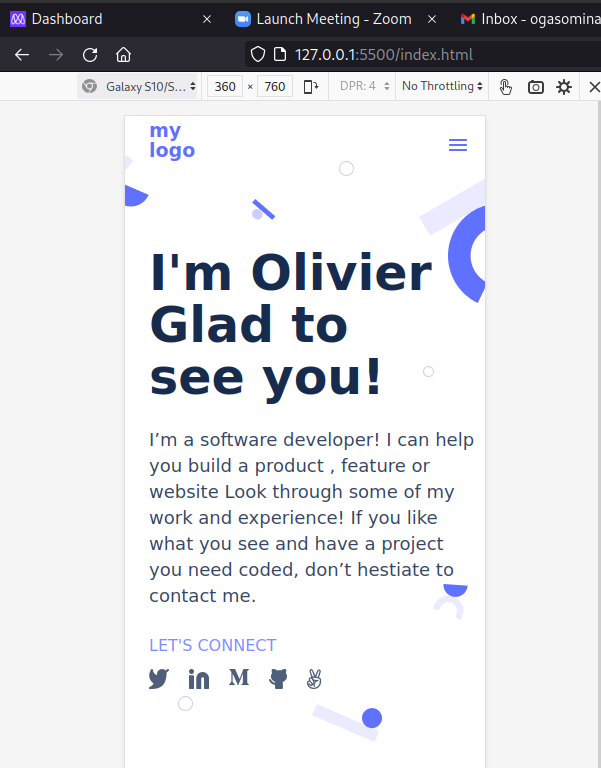

# My-Portfolio

#

> This project is about setting up my portfolio's mobile version skeleton.

Additional description about the project and its features.

## Built With

- html
- css

To get a local copy up and running follow these simple example steps.

### Prerequisites

### Setup

### Install

### Usage

### Run tests

### Deployment

[Click here to view web]()

## Author

👤 **Olivier**

- GitHub: [@GOlivierNation](https://github.com/GOlivierNation)

## 🤝 Contributing

Contributions, issues, and feature requests are welcome!

Feel free to check the [issues page](../../issues/).

## Show your support

Give a ⭐️ if you like this project!

## Acknowledgments

- Hat tip to anyone whose code was used
- Inspiration
- etc

## 📝 License

This project is [MIT](./MIT.md) licensed.
